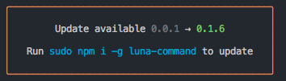

# update-notice

> Update notifications for CLI.




## Install
```bash
npm install update-notice --save
```

## Usage
```javascript
const updateNotice = require('update-notice');
const pkg = require('./package.json');

const notice = updateNotice({
  pkg,
  options: {
    registry: 'https://registry.npmjs.org', //set your own registry
    isSudo: true, // default false
    isGlobal: true, // default false
  },
});

notice.notify();

// notice.notify((chalk) => {
//   return 'Changelog ' + chalk.underline('/path/to/CHANGELOG.md');
// });
```